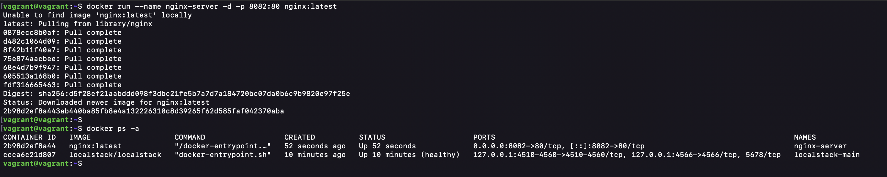
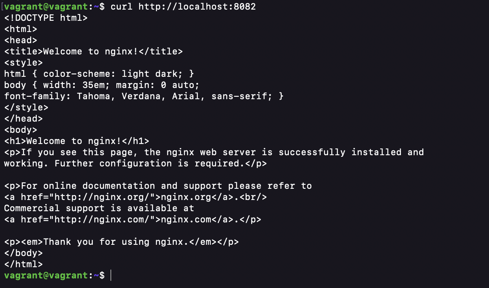

## Day 1 Assignment

#### i. Write a one-page reflection: “Why is DevOps necessary?” with examples.

#### ii. Screenshot proof: Nginx container running locally.

### Screenshot proof: Nginx container running locally.\*\*

Run this command to spin up an Nginx container

```bash
docker run --name nginx-server -d -p 8082:80 nginx:latest

docker ps -a  # Check all running containers
```



**-p:** flag for port
**-d:** flag to run the container in a detach mode

Use `curl` to confirm Nginx page is reachable

```bash
curl http://localhost:8082
```



Confirm that Nginx page is accessible on the browser

```bash
hostname -I  # check the vagrant VM IP address

http://192.168.41.128:8082
```


### Write a one-page reflection: “Why is DevOps necessary?” with examples.

#### Why DevOps Matters: A Reflection

In traditional software development, developers focused on speed while operations focused on stability, often creating conflict and delays. DevOps bridges this gap by fostering collaboration, shared responsibility, and faster feedback loops.

The real strength of DevOps comes from automation and continuous practices. Manual deployments are slow and error-prone, but with automated pipelines like those used at Netflix code can be tested and deployed safely at scale. Similarly, Infrastructure as Code allows companies like Amazon to quickly spin up and replace servers during high traffic events, ensuring resilience and reliability.

Most importantly, DevOps enables agility. Features can be released to small groups of users, monitored in real time, and rolled back instantly if needed. This ability to experiment and adapt quickly has become a competitive advantage.

In short, DevOps is not just a set of tools but a cultural shift. It reduces waste, improves reliability, and helps organizations deliver value to customers faster and more securely.
