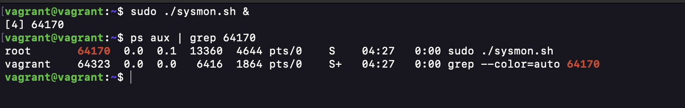

## Day 2 Assignment

1. Update the system monitoring shell script to use well defined commands specific to the metric we are monitoring

2. Set your shell script to run in the background every 5 minutes

3. Attach a download of your log file to your submission

4. Attach a screenshot of your running processes showing the sysmon.

